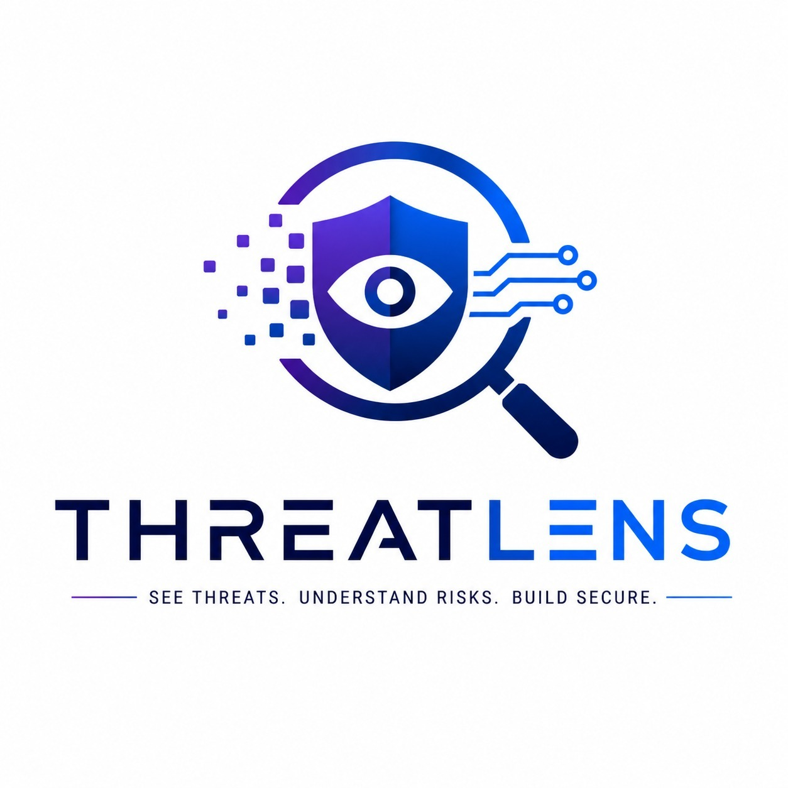
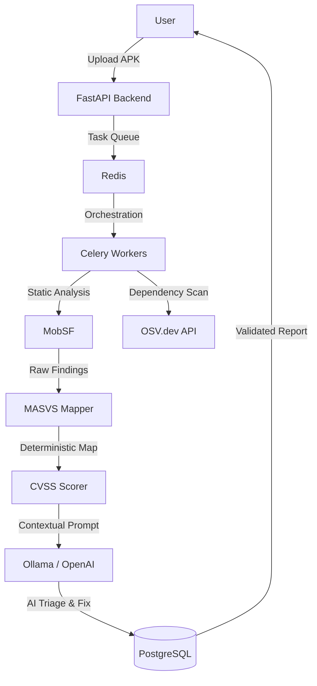

<p align="center">
  
</p>

<h1 align="center">ThreatLens</h1>

<p align="center">
  <strong>Advanced MASVS Audit Copilot & AI-Driven Mobile Security Orchestrator</strong>
</p>

<p align="center">
  
  
  
  
</p>

---

## 🛡️ Overview

**ThreatLens** is a next-generation mobile application security platform designed to bridge the gap between raw static analysis and professional compliance standards. Built specifically for **OWASP MASVS v2**, it automates the tedious mapping of technical vulnerabilities to high-level security controls while utilizing local LLMs (Ollama) or OpenAI to perform contextual triage.

With **ThreatLens**, security teams can transform a 500-page MobSF report into a prioritized, human-validated audit in minutes.

---

## ✨ Key Features

### 🧠 AI-Contextual Triage
Go beyond simple regex checks. ThreatLens uses a **two-pass AI logic**:
1.  **Contextual Validation**: The LLM analyzes the code snippet to determine if a finding is a **True Positive (TP)** or **False Positive (FP)**.
2.  **Smart Remediation**: Generates secure, platform-specific code fixes (Kotlin/Java) following the **OWASP MASTG** guidelines.

### 🗺️ Deterministic MASVS v2 Mapping
The platform features a curated rules engine that maps technical issues (from MobSF and Androguard) directly to **MASVS v2 categories**:
- **MASVS-STORAGE**: Sensitive data protection.
- **MASVS-NETWORK**: Communication security.
- **MASVS-AUTH**: Identity and session management.
- **MASVS-CODE**: Software integrity and quality.

### 👤 Human-in-the-Loop (HITL) Dashboard
A dedicated auditor interface allows security experts to:
- **Confirm Findings**: One-click validation of AI-triaged vulnerabilities.
- **Audit Overrides**: Manually flag False Positives or "Accept Risk" with mandatory justification logging.
- **Feedback Loop**: All manual corrections are stored in the `AuditorFeedback` table to enhance future AI accuracy.

### 📦 SBOM & SCA Analysis
Integrated dependency scanning via **Open Source Vulnerabilities (OSV)** API. Automatically identifies CVEs in compiled libraries (`.so`, `.jar`, `.aar`) and maps them to `MASVS-CODE-3`.

---

## 🏗️ Architecture



---

## 🚀 Quick Start

### 1. Prerequisites
- Docker & Docker Compose
- [Ollama](https://ollama.com) (Optional, for local AI)

### 2. Deployment
```bash
git clone https://github.com/hibalahrouf/ThreatLens.git
cd ThreatLens
cp .env.example .env
docker-compose -f infra/docker-compose.yml up -d --build
```

### 3. Initialize AI (Ollama)
```bash
ollama pull llama3
# In .env: LLM_PROVIDER=ollama, OLLAMA_URL=http://host.docker.internal:11434
```

---

## 💻 CLI Usage

The `threatlens` (formerly `masvs`) CLI is designed for terminal power users and CI/CD pipelines.

```bash
# 1. Register & Login
threatlens auth register --email admin@threatlens.io --password ********
threatlens auth login --token "YOUR_JWT_TOKEN"

# 2. Run an Audit
# Automatically uploads, scans, triages, and scores the APK
threatlens scan run "./app-release.apk"

# 3. CI/CD Integration
# Fails the pipeline if a High severity finding is found
threatlens scan run "./app.apk" --fail-on high --output pdf
```

---

## 🖥️ Web Dashboard

The modern **Next.js** interface provides:
- **Executive Summary**: Security grade (A-F), Global Risk Score, and MASVS compliance coverage.
- **Finding Explorer**: Deep dive into individual vulnerabilities with AI justifications.
- **Remediation Center**: Side-by-side comparison of vulnerable code vs. AI-suggested fix.
- **Auditor Workflow**: Interactive buttons to Accept, Dismiss, or Confirm findings.

---

## 🚀 Reproducing Paper Results

To reproduce the performance metrics and comparison tables reported in the ThreatLens (SoftwareX) paper:

### Reproducing Table 2 metrics
```bash
# Ensure you are logged in to get a token
masvs auth login --token <your_token>

# Run the comparison benchmark
bash benchmark/run_comparison.sh

# View the results
cat benchmark/results/comparison_summary.csv
```
This script runs ThreatLens on the 4 corpus APKs (Diva, InsecureBank, UnCrackable L1/L3) and calculates the alert reduction rate and scan duration reported in the paper.

### Figures 1 and 2
Architecture diagrams represent the system at commit `9c0c173`. To verify, run:
```bash
git checkout 9c0c173
docker compose -f infra/docker-compose.yml up --build -d
docker compose -f infra/docker-compose.yml ps
```
The running services will match the architecture shown in Figure 2.

### Figure 3 (CLI output)
```bash
threatlens scan run docs/samples/UnCrackable-Level1.apk \
  --project SoftwareX-Demo --fail-on high
```

### Figure 8 (Dashboard)
Start the system and navigate to http://localhost:3000 after completing a scan.

---

## ⚠️ 5.1 Limitations

The following limitations should be considered when interpreting the results of this study:

1. Corpus size: The evaluation corpus comprises 4 intentionally vulnerable APKs. Results may not generalize to production applications with different code patterns.
2. Manual audit baseline: Manual audit times were estimated by an experienced auditor rather than measured in a controlled user study.
3. No cross-tool execution comparison: Table 2 is a feature comparison based on documentation. A head-to-head execution benchmark against MobSF standalone or Semgrep on the same APKs was not performed, as these tools operate on different input formats.
4. Sequential LLM triage: The current implementation processes findings one by one, creating a bottleneck for APKs with many findings (e.g., DivaApplication: 793s for 59 findings).
5. LLM confidence scores are not calibrated probabilities and should not be interpreted as statistical confidence intervals.
6. MobSF dependency: ThreatLens inherits all limitations of MobSF's static analysis engine, including limited obfuscation handling.

---

## 📄 License

This project is licensed under the **MIT License** - see the [LICENSE](LICENSE) file for details.

---

