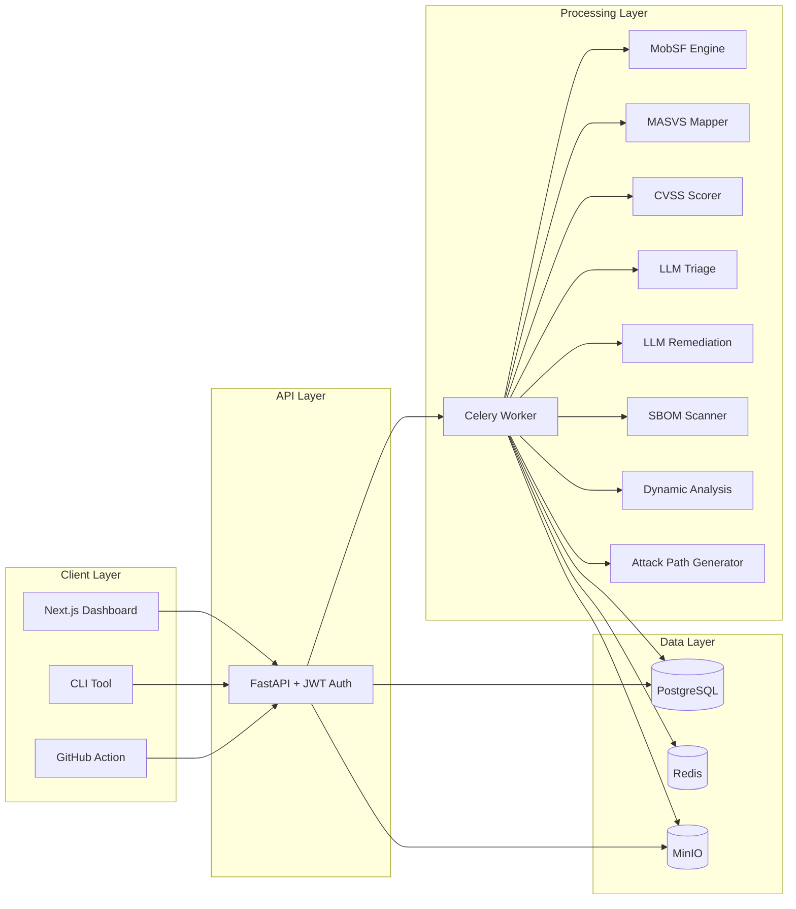

# MASVS Audit Copilot Architecture

MASVS Audit Copilot is a modular full-stack audit platform for mobile application security assessments. The runtime is split into a web client, command-line client, FastAPI API, Celery processing workers, and supporting infrastructure services.

## Main Data Flow

1. A user uploads an APK, IPA, XAPK, or AAB through the dashboard or CLI.
2. The API validates the request, creates a scan record, stores the artifact in MinIO, and enqueues a Celery job.
3. The worker downloads the artifact, runs MobSF, maps findings to MASVS controls, scores them, checks SBOM dependencies, and runs AI triage/remediation when configured.
4. The worker stores findings, semantic root-cause groups, executive summary data, priority metadata, and attack paths in PostgreSQL.
5. Reports are generated on demand as PDF, Markdown, or SARIF and stored in MinIO.

## Production Notes

- Database schema changes are managed through Alembic migrations.
- Static, dynamic, LLM, and report workloads should be split into dedicated Celery queues as volume grows.
- MobSF, emulator sessions, and LLM calls are the main throughput bottlenecks.
